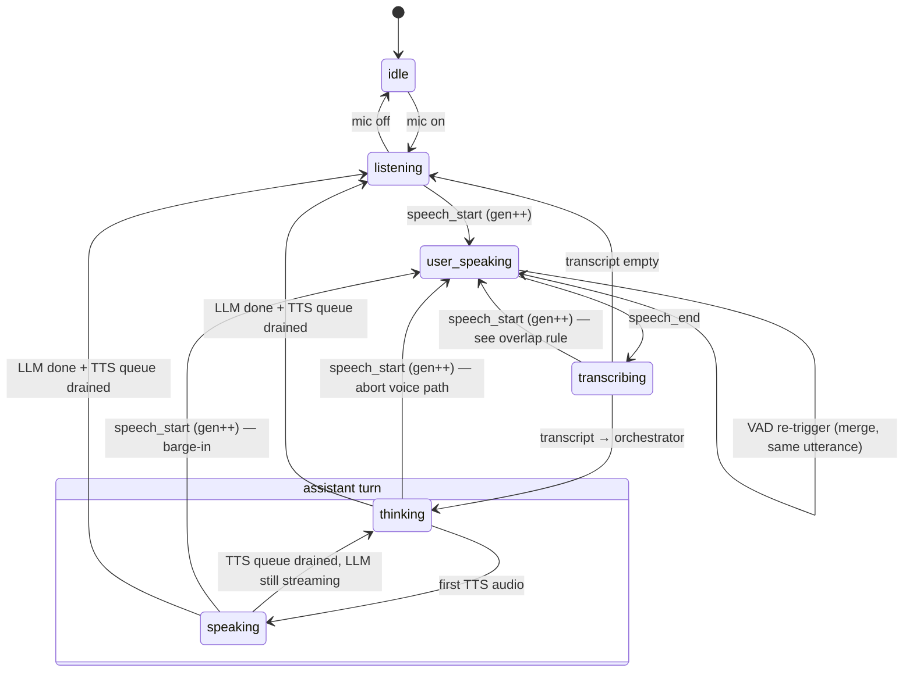

# FLOW — Orchestrator state machine

Node owns all sequencing: turns, barge-in, the LLMs, the question queue, and what gets spoken. Python stays dumb inference. Read together with [IDEA.md](IDEA.md).

## Pipelines

Three concurrent concerns, coordinated by Node:

| Pipeline | What it does | Cancels on barge-in? |
| --- | --- | --- |
| STT | Always streaming mic → Silero + Whisper; emits `speech_start`, `speech_end`, `transcript` | No — never stops listening |
| LLM | Orchestrator (conversation) + agentic agent + minions | Voice path only (see below) |
| TTS | Streams sentences → Kokoro → speaker | Yes — generation, queue, and playback |

## Core concepts

- **generation_id (epoch).** Incremented on every `speech_start`. Every async result (transcript, LLM chunk, TTS audio) is tagged with it; anything arriving with an old generation is dropped.
- **Voice path vs background work.** Barge-in kills only the voice path: TTS generation + playback buffer + orchestrator stream. Background work survives: an in-flight `ask` runs to completion and its result is injected into context; minions keep working.
- **Node is the source of truth** for the minion registry and the question queue. LLM context is never trusted for state.

## Voice layer states

Orthogonal flags, not states: `pending_question` (question queue head active), `tool_running` (orchestrator inside an `ask` call), `echo` (debug bypass: transcript → TTS directly).

Notes:

- `thinking` and `speaking` interleave freely while the LLM streams sentences.
- Entering `listening` with a question queue head that was never spoken → speak it now.
- On entering `user_speaking` from `thinking`/`speaking`: full voice-path abort (below).

## Barge-in: what exactly happens on `speech_start`

1. `gen++`.
2. Send `cancel` to Python TTS. A cancelled utterance **never receives `audio_end`** — Node treats cancel as terminal for it and resets its counters.
3. Client stops playback (`player.stop()` on `speech_start`; ~100 ms of scheduled audio plus Bluetooth tail may still leak — see mic/speaker rules).
4. Abort the orchestrator stream (`AbortController`).
5. If `tool_running`: the agentic side is **not** aborted. When the `ask` completes, its result is injected into orchestrator context as a pending tool result, so the next turn sees it.
6. Minions: untouched.

Post-cancel race rules:

- Binary TTS frames carry no id; attribution is by order after `audio_start`. Keep **one speak in flight**; after a cancel, drop all TTS binary until the next `audio_start` of the current generation.
- Transcript of generation N arriving while generation N+1 is already in flight: drop it.
- Continuation merge: if a new `speech_start` arrives within ~1.5 s of the previous `speech_end` and the assistant has said nothing yet, append instead of starting a new turn (mitigates VAD cutting mid-thought).

## Overlap rule (transcript arrives late)

If `speech_start` fires while still `transcribing`, the old utterance's transcript is dropped per the rule above — the new utterance wins. Cheap and deterministic; Whisper passes are 200–500 ms so this is rare.

## Question queue (`ask_user`)

Sources: the agentic agent's `ask_user` tool; minion questions routed through the agentic agent.

- **Strict FIFO.** Only the head is active: it is the only question spoken, and the only one visible to the orchestrator as `pending_question` in its context.
- **Blocking head.** The head stays active until answered. Barge-in does **not** cancel it; if its TTS is cut mid-question, the orchestrator (which sees it pending) decides whether to repeat it. No automatic repeats.
- **Exactly three exits:**
  1. **Answer** — the orchestrator routes a user utterance as the answer → resolve with the text.
  2. **Timeout** — 60 min (env-configurable) → resolve `{status: "timeout"}`. The caller must be able to continue without an answer.
  3. **Explicit cancel** — only when the user explicitly drops it ("olvídalo") or the orchestrator detects a definitive topic change; in the latter case the orchestrator **voices the cancellation** before resolving `{status: "cancelled"}`. No implicit cancellation, ever.
- Head answered → dequeue; the next question is spoken on the **next** `listening` turn, never over the user's answer.
- Callers block on the promise inside their tool call (no open HTTP stream while waiting). Agent system prompts must teach: "the user may never answer → decide on your best judgment or abort gracefully."

## LLM layers

### Orchestrator (conversation)

- Input: final transcripts, app context, pending question, injected `ask` results.
- Tools: `ask(question)` to the agentic agent. Keep the toolset minimal — context hygiene is the point.
- Rules: responses always go to TTS; short, spoken-style, no markdown/lists/code. Sanitize + hard length cap before TTS regardless.
- Narration: the model is prompted to say something before long tool calls ("dale, lo consulto"). No canned fillers from Node; silence during long asks is accepted for v1.

### Agentic agent

- Tools: create/list/kill/talk-to minions, `ask_user`, `answer`.
- **Serialized mailbox:** one LLM call in flight per agent; concurrent inputs (orchestrator's `ask`, minion `ask`s) queue. Never interleave into one conversation.
- `answer` must be short: enforce in prompt + truncate hard in Node before injecting into orchestrator context.

### Minions

- One tool only: `ask` (to the agentic agent), used when they need input. Questions must carry full context: what they're working on, why they're asking, where they're stuck.
- Run in background; survive barge-in and conversation turns.
- Their questions to the user go through the question queue via the agentic agent.

### Guards

- Loop/depth guard on minion → agentic → orchestrator chains.
- Per-`ask` timeout (default 10 min) → resolve as error; the orchestrator speaks the failure.
- Watchdog on agentic tool-call count and spend.

## Context and memory

- **Window** (what goes to the model): system prompt + recent messages + pending question + injected results. Token budget triggers **compaction between turns only, never mid-turn**.
- **Log** (append-only, on disk): everything, including aborted turns, tool calls, and minion events. The log is not the window.

## Errors and timeouts

| Failure | Behavior |
| --- | --- |
| LLM API error mid-turn | Speak the error via TTS, back to `listening` |
| Whisper empty transcript | Drop silently, stay `listening` |
| `ask` timeout | Error result → orchestrator voices it |
| Question timeout (60 min) | Resolve `{status:"timeout"}` |
| Python WS closed | Error to client, reconnect with backoff; voice-path state dies, registries survive |

## Mic / speaker rules

- The mic is **always forwarded** to Python, including while TTS plays (no gating — gating kills barge-in).
- Browser AEC on (`echoCancellation: true`); headphones recommended — speakers leak into the mic.
- Barge-in debounce: require sustained speech (`MIN_SPEECH_MS` ≥ 300–400 ms) before acting.
- Drop transcripts from utterances shorter than ~400 ms that started during TTS playback or within ~300 ms after playback ended (echo tail).
- Client keeps `player.stop()` on `speech_start`.

## Contracts delta vs today

- `node/src/server.ts`: remove the `pendingSpeak === 0` mic gate (`server.ts:479`); add generation ids, question queue, mailbox, minion registry.
- Python protocol: unchanged (no partial transcripts for now).
- Node → client: add `question_asked` / state events for UI as needed.
